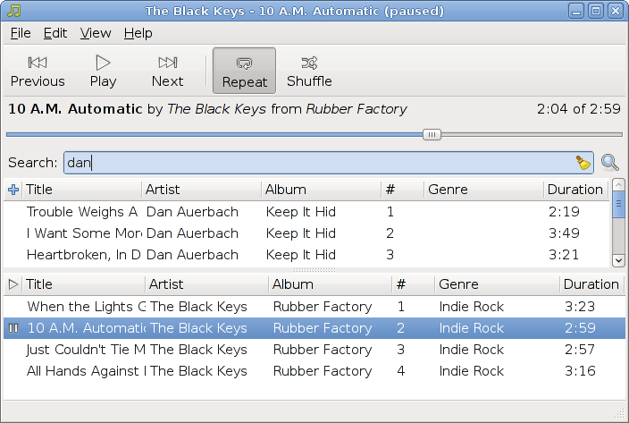

What is Hum?
------------
Hum aims to be a lightweight, quick, easy-to-use music manager with powerful
search, collection, and tagging abilities.

'But wait!', Hum hears you plaintively cry, 'How can Hum have its cake and eat
it, too?'

Well, by standing on the shoulders of giants, that's how. To this end, Hum
plans on letting [Tracker](http://www.tracker-project.org/) manage the
collection, search, metadata, and tagging functionalities, while the equally
awesome [GStreamer](http://gstreamer.freedesktop.org) manages all the playback
nastiness.

Smart, huh?

At the moment, however, Hum is a mere shadow. It is a hollow and barren shell
of what it could potentially be, barely capable of even the simplest tasks. It
yearns for love and care, the kind of tender nurturing that only other open
source developers with a passion for simplicity and usability can give.

Won't you help turn this homely little app into something your mother would
enjoy listening to her Benny Goodman on?

Dependencies
------------
 * Vala 0.7.6 or better (if you feel like building the source)
 * Tracker < 0.8.0 (I'm working on catching up to all the progress in the 0.8
   and 0.9 branches)
 * GTK 2.16 or better
 * GStreamer 0.10 or better

How can I get my grubby little mitts on this greasy goodness?
-------------------------------------------------------------
Ideally, a package for it exists within your Linux distribution's repository.
Packagers, please let me know if this is the case, and I'll gladly update this
page to reflect the fruits of your labor. Heck, I'll be pleased if anybody
other than my wife and I use this stuff.

### Arch Linux ###
I've taken the liberty of throwing together a
[PKGBUILD](http://github.com/downloads/monodeldiablo/hum/PKGBUILD) for you Arch
Linux users out there. It works for me, which was the only verification I could
be bothered to do.

### Everybody else ###
Tough poopy! HAHAHAHAHAHAHA!!!

Just kidding. Ehem.

For those of you living in different distros, you may
[download](http://github.com/monodeldiablo/hum/downloads) the latest source
tarball from the project site (ignore the "tags" section... that way lies
doom). Ensure that you have recent versions of Vala, Tracker, GTK, and
GStreamer, then cross your fingers and invoke this madness:

    $ ./configure && make && make install

If that didn't work and you can't play with Hum,
[file an issue](http://github.com/monodeldiablo/hum/issues) at the project site
and work shall commence with haste (unless I'm on a beach!). Better yet,
contribute a patch and we can become best friends!

License
-------
Hum is free software; you can redistribute it and/or modify it under the terms of the GNU General Public License as published by the Free Software Foundation; either version 2 of the License, or (at your option) any later version.

Hum is distributed in the hope that it will be useful, but WITHOUT ANY WARRANTY; without even the implied warranty of MERCHANTABILITY or FITNESS FOR A PARTICULAR PURPOSE.  See the GNU General Public License for more details.

You should have received a copy of the GNU General Public License along with Hum; if not, write to the Free Software Foundation, Inc., 51 Franklin St, Fifth Floor, Boston, MA  02110-1301  USA

Authors
-------
Brian Davis (brian.william.davis (at) gmail.com) & Marijana Šurković (marijana.surkovic (at) gmail.com)

Contact
-------
Brian Davis (brian.william.davis (at) gmail.com)

Download
--------
You can download this project in either [zip](http://github.com/monodeldiablo/hum/zipball/master) or [tar](http://github.com/monodeldiablo/hum/tarball/master) formats.

You can also clone the project with [Git](http://git-scm.com) by running:

    $ git clone git://github.com/monodeldiablo/hum
